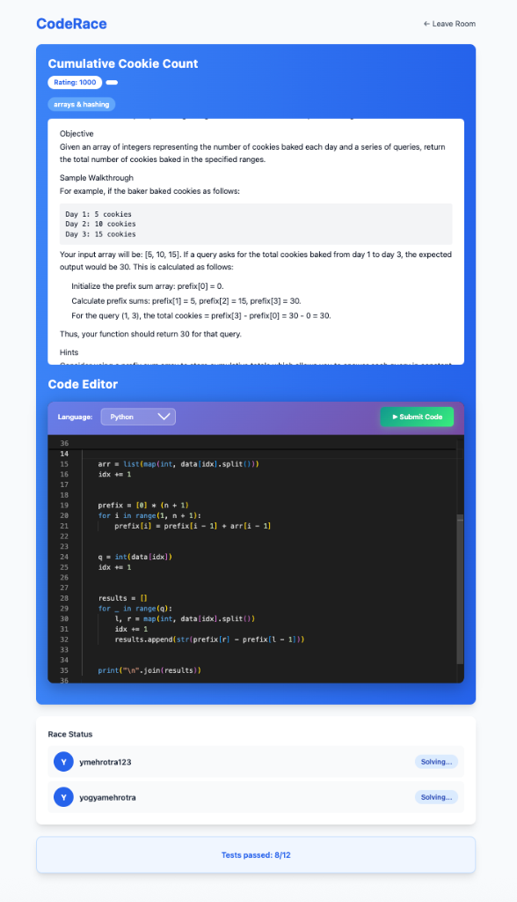
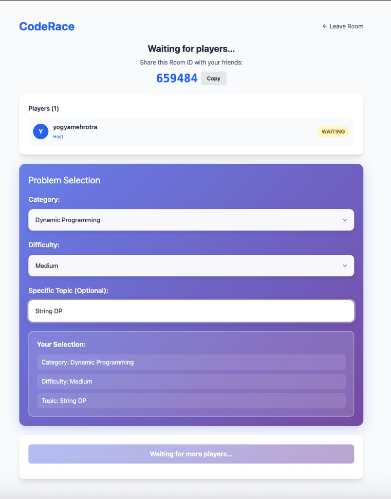

# CodeDuel 🏁

A real-time competitive coding platform where developers race to solve AI-generated programming challenges. Built with Spring Boot, React, and OpenAI.

[](https://codeduel-frontend.railway.app)
[](https://spring.io/projects/spring-boot)
[](https://reactjs.org/)
[](LICENSE)

## 📸 Screenshots

### Problem Walkthrough


### Waiting Room


## ✨ Features

- **AI-Powered Problems**: Generates unique algo problems using OpenAI (GPT-4/3.5).
- **Real-Time Multiplayer**: Race against friends with live status updates via WebSockets.
- **Code Execution**: Secure, sandboxed code execution using Piston API.
- **Languages**: Python, Java, C++, JavaScript.
- **Security**: Google OAuth2, JWT authentication, OWASP sanitization.

## 🛠️ Tech Stack

**Backend**
- **Java 17** & **Spring Boot 3.2.0**
- **PostgreSQL** (Data) & **Flyway** (Migrations)
- **Spring WebSocket** (STOMP)
- **Spring Security** (OAuth2, JWT)

**Frontend**
- **React 18** & **Vite**
- **Tailwind CSS**
- **Monaco Editor**

## 🚀 Quick Start

### Prerequisites
- Java 17, Node.js 18+, PostgreSQL

### Setup
1. **Clone**: `git clone https://github.com/yogyam/CodeDuel.git`
2. **Database**: Create a Postgres DB named `codeduel`.

### Configuration
**Backend** (`backend/.env`):
```properties
SPRING_DATASOURCE_URL=jdbc:postgresql://localhost:5432/codeduel
SPRING_DATASOURCE_USERNAME=postgres
SPRING_DATASOURCE_PASSWORD=password
OPENAI_API_KEY=sk-...
OPENAI_API_URL=https://api.openai.com/v1/chat/completions
JWT_SECRET=your_secret
SPRING_SECURITY_OAUTH2_CLIENT_REGISTRATION_GOOGLE_CLIENT_ID=...
SPRING_SECURITY_OAUTH2_CLIENT_REGISTRATION_GOOGLE_CLIENT_SECRET=...
CORS_ALLOWED_ORIGINS=http://localhost:5173
```

**Frontend** (`frontend/.env`):
```bash
VITE_BACKEND_URL=http://localhost:8080
```

### Run
**Backend**:
```bash
cd backend && mvn spring-boot:run
```

**Frontend**:
```bash
cd frontend && npm install && npm run dev
```

## 📝 License
MIT License - see [LICENSE](LICENSE).
